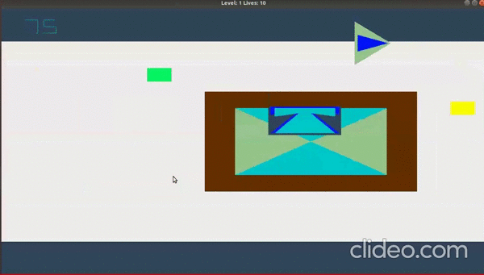

# JetPack JoyRide
This is a 2D Jetpack JoyRider game you must have played in childhood, implemented using OpenGL. 

  

## Usage
 1.Create a build folder`mkdir build`
 2.cd into build folder `cd build`
 3.run : `cmake ..`
 4.run `make all`
 5.compile `./graphic_asgn1`

### Game Controls:
- SpaceBar- Jump
- Left/Right Arrows- Navigation
- Up/Down- Shoot waterballoons in Up/Downwards

This was done as part of the Graphics course at IIIT Hyderabad.
